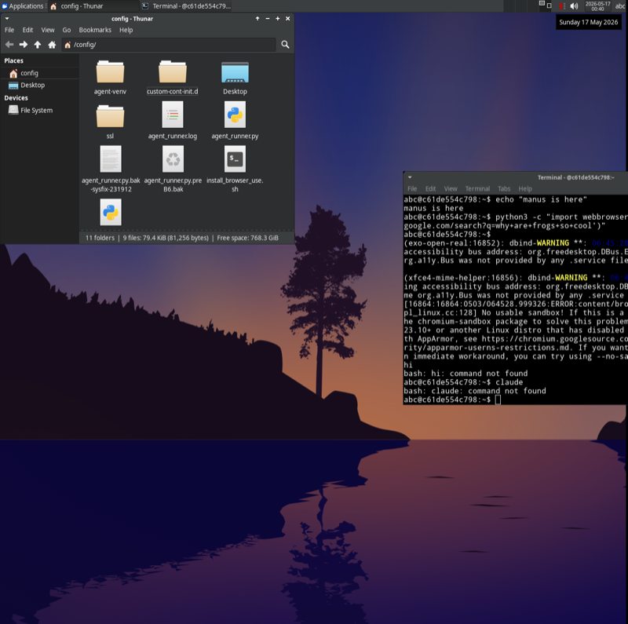

<div align="center">

# Destiny Computer

### The body for every employee's AI.<br/>A persistent Linux desktop the AI owns, the operator watches, the team can grab the mouse anytime.<br/>$0.05–$0.40 per task. Your data never leaves your network.

[](./LICENSE)
[](https://github.com/karany97/nandai-atelier)
[](https://github.com/anthropics/anthropic-quickstarts/tree/main/computer-use-demo)
[](./driver/src)

</div>

---

## What it is

A `docker compose up` that gives you a **persistent Linux desktop**
(Ubuntu + Firefox + a real shell + Python + whatever else you install)
reachable in your browser via [KasmVNC](https://kasmweb.com/kasmvnc),
paired with a **driver** (v0.2 — real Anthropic Computer Use loop) that
takes natural-language goals from any chat surface, screenshots the
desktop, decides the next click, executes via `xdotool`, and streams
step records back via Server-Sent-Events.

It's the *body* for every employee's AI. Part of the
[Destiny ecosystem](https://github.com/karany97/nandai-atelier/blob/main/docs/ECOSYSTEM.md):
the chat ([atelier](https://github.com/karany97/nandai-atelier)) dispatches
goals; this repo turns them into clicks; the operator watches both
surfaces in one window. Hand off, take back, never sign in to a SaaS
to do it.

### "One desktop" vs "a fleet of desktops"

This repo is the **single-desktop** pattern — one KasmVNC container,
one driver, one Anthropic API key, ~600 LOC of Python you can read on
a coffee break. Best for learning the moving parts, demos, or "I want
exactly one AI body and no surprises."

For the **multi-session** flavor — N Sway/Wayland sessions behind one
FastAPI fleet, swappable open-weights model
([Holo3-35B-A3B](https://huggingface.co/HCompany/Holo3-35B-A3B), Apache
2.0, OSWorld-Verified 77.8%), iframe-embed any session anywhere — see
the sibling repo [karany97/atelier-os](https://github.com/karany97/atelier-os).

Same `/api/computer/*` shape, so atelier wires up to either with
zero changes.

We run this in production with one desktop per team member (Karan,
Janvi, Devika, Priya, Aayush). The container persists `/home/operator/`
between restarts so the AI's work — open tabs, generated scripts, ssh
keys it created, partial downloads — survives reboots.

```
   ┌──────────────────┐         ┌────────────────────────────┐
   │ Destiny Atelier  │  ───▶   │  Destiny Computer          │
   │  (the chat)      │         │  ┌──────────────────────┐  │
   │                  │  iframe │  │  KasmVNC Linux       │  │
   │  left pane:      │  embeds │  │  (the desktop you    │  │
   │  conversation    │   the   │  │   watch + can drive) │  │
   │                  │  right  │  └──────────────────────┘  │
   │  right pane:     │   pane  │  ┌──────────────────────┐  │
   │  live desktop    │         │  │  driver (the AI loop)│  │
   │  (this)          │  ◀───   │  │  screenshot→think→act│  │
   └──────────────────┘ replies │  │  narrates back       │  │
                                │  └──────────────────────┘  │
                                └────────────────────────────┘
```

## What "the desktop" actually looks like



*Captured via the driver's own `/screenshot` endpoint against `operator-desktop`
(linuxserver/webtop:ubuntu-xfce, 1368x1360, 13-day uptime as of 2026-05-16).
The same PNG path the Anthropic Computer Use loop sends to the model on
every iteration — this is what the AI sees when deciding the next click.*

## Why this isn't UI-TARS-desktop (the obvious competitor)

[bytedance/UI-TARS-desktop](https://github.com/bytedance/UI-TARS-desktop)
is an **Electron app you install on your real laptop** that takes over
your real keyboard with a ByteDance vision model. Destiny Computer is
`docker compose up` that gives every teammate **their own persistent
Linux desktop**, embedded in your chat, driven by any model you want
(Anthropic, local Qwen, mix). The AI's files survive restarts. You
watch every click. You take the mouse back any time. MIT,
**$0.05–$0.40 per task**, your data never leaves your network.

| | UI-TARS-desktop | Destiny Computer |
|---|---|---|
| Form factor | Electron app on your laptop | `docker compose up` web service |
| Per-employee isolation | Single user | One container per teammate |
| Persistence | Cloud VMs release on navigate-away | `/home/operator/` survives reboots |
| Embeddable in your chat | No (standalone window) | Yes (Atelier right pane + SSE stream) |
| Model choice | UI-TARS-1.5-7B / Seed-1.5-VL only | Any model (Anthropic / local / mix) |
| Fleet (multi-machine) | No | Yes via `@hostname` syntax (network-agent) |
| Audit log per turn | No | Step records over SSE, every action logged |
| Self-host floor | Local mode = your real OS | 100% your Docker host, no cloud dep |
| Governance | ByteDance roadmap | MIT, no corporate gatekeeper |

The "in the market of Iron, sell Gold" angle: UI-TARS gives you one
Electron window. We give you a per-employee fleet you address by name.

## Why this isn't OpenHands or Claude Cowork or E2B

**OpenHands** — open source, has a browser+terminal loop, but the UX is
"agent decides everything, you watch a log spool by." No conversational
narration. No "the desktop stays running between sessions with your
browser tabs still open." Workspace is ephemeral.

**Claude Cowork** — closed source, $20-200/mo, **macOS/Windows only**,
runs on YOUR host (so it takes over your real keyboard while it works).
Polished UX but the wrong residency model — you can't put it on a VPS
or share it across teammates.

**E2B / Daytona / Scrapybara** — battle-tested sandboxes for code
execution, but their "desktop" tier has a 24-hour session cap or costs
$50-300/mo per always-on instance.

**Anthropic Computer Use API** — the model-side capability is real, but
you still have to *supply* the VM. There's no managed product that pairs
"persistent desktop + watchable VNC + conversational handoff + your
hardware or a $5 VPS" — until now.

## Install

### Quickstart (Docker compose)

```bash
git clone https://github.com/karany97/destiny-computer.git
cd destiny-computer
cp .env.example .env
# Edit .env: set ANTHROPIC_API_KEY, DESKTOP_PASSWORD, optional ATELIER_URL

docker compose up -d
# → KasmVNC desktop at  http://localhost:6901  (password from .env)
# → Driver health at    http://localhost:8090/health
```

### Verify your install

```bash
# stdlib-only, no pip install. Walks /health → /screenshot → /api/budget
# → /api/tasks → /api/desktop/snapshot lifecycle. Reports PASS/FAIL per
# check; exits 0 if all green, 1 if any fail. Won't dispatch a real
# Anthropic task by default (set SMOKE_RUN_TASK=1 to opt in — costs $).
python3 scripts/launch-smoke.py
```

Operators behind bearer auth pass the token:

```bash
DRIVER_URL=http://localhost:8090 \
DESTINY_API_TOKEN=$(grep DESTINY_API_TOKEN .env | cut -d= -f2) \
python3 scripts/launch-smoke.py
```

### Pair with Destiny Atelier

If you already run [Destiny Atelier](https://github.com/karany97/nandai-atelier),
just open Settings → Computer and paste:

```
KasmVNC / noVNC URL: http://localhost:6901/
```

Then `⌘\` (Cmd+Backslash) toggles the right-pane Computer view. Done.

### Pair with anything else

The KasmVNC URL works in any iframe (sandboxed) or in a fresh browser
tab. Your existing chat is unaffected.

## What's in the box

```
destiny-computer/
├── compose/
│   ├── docker-compose.yml       — desktop + driver + reverse proxy
│   └── caddy/                   — optional TLS + auth in front
├── driver/
│   ├── Dockerfile
│   └── src/
│       └── main.py              — the manus_computer loop:
│                                  screenshot → vision model → action →
│                                  narrate → repeat
├── docs/
│   ├── architecture.md          — the chat ↔ driver ↔ desktop dance
│   ├── security.md              — what the AI can and cannot do
│   └── operations.md            — runbook: backup, snapshot, reset
├── .env.example
├── LICENSE                       — MIT
└── README.md
```

## What's supported

| | v0.2.1 (this) | v0.3 | v0.4 |
|---|---|---|---|
| Persistent desktop (KasmVNC, files survive restart) | ✅ | ✅ | ✅ |
| Conversational narration ("opened X, want me to Y?") | ✅ (SSE stream) | ✅ | ✅ |
| Anthropic Computer Use API path | ✅ (computer_20251124, Sonnet 4.5) | ✅ | ✅ |
| Per-task cost ledger + daily cap enforcement | ✅ | ✅ | ✅ |
| Live transcript stream (Server-Sent-Events) | ✅ (`/api/task/{id}/stream`) | ✅ | ✅ |
| **Local-only vision (Holo3-35B-A3B via vLLM sidecar)** | ✅ (PR #13, `vision.py`) | ✅ | ✅ |
| **Snapshot + restore desktop state** | ✅ (PR #10, `snapshot.py`) | ✅ | ✅ |
| **Optional Bearer-token auth + per-task rate limit** | ✅ (PRs #4, #9) | ✅ | ✅ |
| **Install verifier** (`scripts/launch-smoke.py`) | ✅ (PR #14) | ✅ | ✅ |
| Multi-user (one desktop per user) — see [atelier-os](https://github.com/karany97/atelier-os) | ❌ (out of scope) | ❌ (out of scope) | ❌ (out of scope) |
| Real-time keystrokes from chat to desktop | ❌ | ❌ | ✅ |
| File-drop from chat to desktop home | ❌ | ✅ | ✅ |
| OmniParser / Moondream / GPT-4o vision backends | ❌ | ✅ | ✅ |
| Browser cookies persist across "restart driver" | ✅ (via volume) | ✅ | ✅ |

## Cost reality

| Backend | Cost per active hour |
|---|---|
| Self-hosted on your spare PC | $0 |
| Self-hosted on a $5/mo VPS (Hetzner CX21) | $0.007 |
| Anthropic Computer Use API (model side, Sonnet 4.5 default) | $0.05–$0.40 per task (avg 30 steps); Opus 4.5 override 5× that |
| Local vision model (UI-TARS-1.5-7B) | $0 + your GPU |

Default `.env.example` uses Anthropic Computer Use because it's the
SOTA today; one env-var flip (`VISION_BACKEND=local-uitars`) + the
opt-in `local-vision` compose profile gives you fully-local Holo3
inference at $0/task. Both paths route through the same
`driver/src/vision.py` abstraction (`VisionBackend` ABC); switching
is reversible by changing the env back. See the **Local vision**
subsection below for the 3-command recipe.

### Local vision (issue #7 — opt-in `local-vision` compose profile)

The `local-vision` compose profile ships a vLLM sidecar serving
[Holo3-35B-A3B](https://huggingface.co/Hcompany/Holo3-35B-A3B) (the
#1 OSS computer-use model on OSWorld-Verified at 77.8%, MoE with
~3B active params — fits on a single 24 GB GPU):

```bash
# 1. NVIDIA Container Toolkit installed on host (24 GB GPU minimum)
# 2. Switch the driver to local vision in .env
sed -i 's/^VISION_BACKEND=anthropic/VISION_BACKEND=local-uitars/' .env

# 3. Bring up the driver + desktop + Holo3 sidecar
docker compose --profile local-vision up -d
```

First boot downloads ~70 GB of Holo3 weights to the `holo3-models`
named volume (survives `docker compose down`; ~30 s on subsequent
boots).

The `loop.py` autonomous loop now routes through `vision.py`'s
`Holo3VisionBackend` automatically when `VISION_BACKEND=local-uitars`
(`anthropic` stays the default for v0.2.x back-compat). Every action
(`click`/`type`/`key`/`scroll`/`wait`/`done`) round-trips through
Holo3 and the existing desktop dispatcher — no Anthropic credits
consumed. `cost_usd` reports as `$0.00` for every local step (tokens
still captured in the ledger so operators can see "5 Holo3 calls
today, $0.00" instead of nothing).

## Security

| Threat | What this does about it |
|---|---|
| Arbitrary AI clicking inside your desktop | Container isolation — desktop runs in `--no-new-privileges --cap-drop=ALL --read-only` where possible. AI can break the desktop; it can't escape the container. |
| AI exfiltrating your secrets | Browser inside the desktop has its OWN cookie jar (Docker volume), separate from your real browser. AI can see what you logged it into; it can't read your real Chrome. |
| Strangers driving your desktop | KasmVNC password gate by default. Optional Caddy + Authelia for SSO. Optional [pingate](https://github.com/karany97/pingate) for the simple PIN-cookie pattern. |
| Random callers hitting `/api/task` and spending your Anthropic credits | Optional `DESTINY_API_TOKEN` env — set it and every `/api/*` + `/screenshot` requires `Authorization: Bearer <token>`. Constant-time comparison via `hmac.compare_digest`. `/health` stays open for Docker healthchecks. Query-param tokens deliberately rejected (leak via access logs + Referer). Same pattern as atelier-os (different env name so the two fleets can rotate independently). |
| Authenticated client bursting `/api/task` to burn the daily cap in seconds | Per-client leaky-bucket — default 10 tasks/minute, configurable via `DESTINY_TASK_RATE_LIMIT=N/{sec,min,hour}`. Keyed by Bearer token when set, else client IP. Returns 429 + `Retry-After`. Rate-limit dep runs AFTER auth so a 401 doesn't consume a slot (no bucket-exhaust DoS via bad-auth spam). |
| AI typing into your real keyboard | Impossible — the desktop is INSIDE a container; the AI's clicks/keystrokes never reach your host. |
| Long-running task spending unbounded $ on Anthropic | `MAX_STEPS_PER_TASK` env var (default 30); `MAX_USD_PER_DAY` env var (default 1.00). Hits the cap → driver stops + tells the chat. |

Full threat model in [docs/security.md](./docs/security.md).

## Configure

| Env var | Default | What it does |
|---|---|---|
| `ANTHROPIC_API_KEY` | *(required for Anthropic Computer Use mode)* | Your API key |
| `DESKTOP_PASSWORD` | *(required)* | Password for KasmVNC web access |
| `ATELIER_URL` | *(empty)* | If set, the driver reports back to this Atelier instance via webhook |
| `DESTINY_API_TOKEN` | *(empty = no auth)* | Optional Bearer-token gate on `/api/*` + `/screenshot`. Generate: `openssl rand -hex 32` |
| `DESTINY_TASK_RATE_LIMIT` | `10/min` | Per-client (token or IP) leaky-bucket on `POST /api/task`. Format `N/{sec,min,hour}`. 429 + `Retry-After` on overflow. |
| `HOLO3_ENDPOINT` | `http://holo3:8000/v1` *(when `--profile local-vision` on)* | OpenAI-compatible vLLM endpoint serving Holo3-35B-A3B. Override for host-managed vLLM. |
| `HOLO3_MODEL` | `Hcompany/Holo3-35B-A3B` | Model id passed to vLLM. |
| `HOLO3_API_KEY` | `EMPTY` | If you protect vLLM with an API key, set it both here and on the sidecar. |
| `DESTINY_SNAPSHOT_REPO` | `destiny-desktop-snapshot` | Docker image repo for `POST /api/desktop/snapshot` tags |
| `DESTINY_SNAPSHOT_TIMEOUT_S` | `60` | `docker commit` ceiling — bump if your desktop is huge |
| `DESTINY_RESTORE_TIMEOUT_S` | `60` | `docker run` ceiling for `POST /api/desktop/restore` |
| `MAX_STEPS_PER_TASK` | `30` | Hard cap on autonomous action steps per goal |
| `MAX_USD_PER_DAY` | `1.00` | Anthropic budget cap |
| `VISION_BACKEND` | `anthropic` | `anthropic` \| `local-uitars` (Holo3 via vLLM, PR #13) \| `holo3` (alias) |
| `DESKTOP_RESOLUTION` | `1280x720` | Desktop screen size |

## Roadmap

- **v0.2.1 (now — the launch-sprint release)** — full end-to-end shipping
  state. KasmVNC desktop + Anthropic Computer Use loop (Sonnet 4.5 default,
  `computer_20251124` schema). Per-task cost ledger, daily cap, SSE step
  stream. All 11 action verbs via xdotool. **Optional Bearer-token auth**
  (`DESTINY_API_TOKEN`), **per-task rate limit** (`DESTINY_TASK_RATE_LIMIT`),
  **snapshot/restore API** (4 endpoints + most-recent delete safeguard),
  **local-vision routing** (`VISION_BACKEND=local-uitars` via the
  `local-vision` compose profile, $0/task on a 24 GB GPU), **install
  verifier** (`scripts/launch-smoke.py`). 424 unit tests, all green
  in 2.4s. CHANGELOG documents every PR.
- **v0.3 (target Jul 2026)** — File-drop from chat to desktop home;
  alternate vision backends (OmniParser, Moondream, GPT-4o); replay
  via `Last-Event-ID` on the SSE stream so reconnecting clients
  catch up on history.
- **v0.4 (target Sep 2026)** — Real-time keystrokes from chat to
  desktop; recipe library ("scrape this site", "do this every morning
  at 7am") with operator-shareable templates.

## License

[MIT](./LICENSE). Fork it, sell it, run it on your hardware or a VPS, share it with your team.

## Acknowledgements

- **[Anthropic computer-use-demo](https://github.com/anthropics/anthropic-quickstarts/tree/main/computer-use-demo)** — the reference implementation we wrap
- **[KasmVNC](https://github.com/kasmtech/KasmVNC)** — the web-native VNC server that makes the desktop iframe-able
- **The Destiny Atelier sprint** that defined what the chat-side integration looks like
